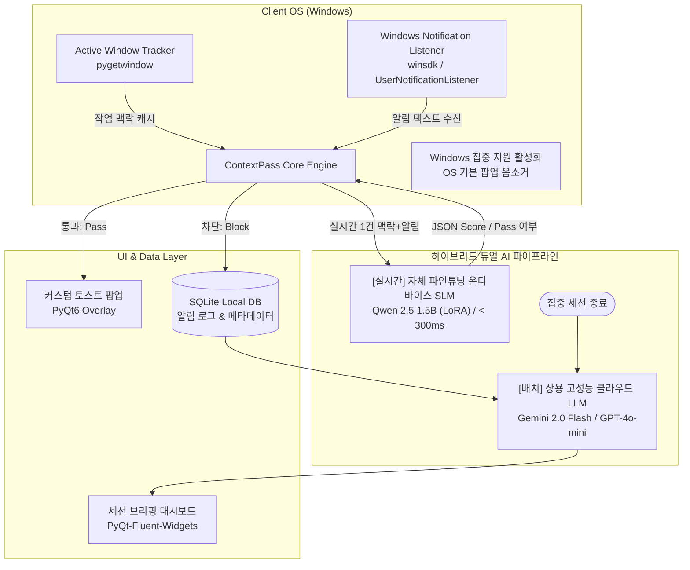
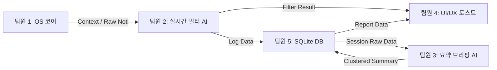

# 🧠 ContextPass (가칭)
> **작업 화면 맥락과 중요도를 실시간 분석하는 지능형 PC 알림 필터링 및 요약 서비스**  
> *AI 서비스 프로젝트 (3학년 2학기 팀 프로젝트)*

---

## 📌 1. 프로젝트 개요 및 문제 정의

### 1.1 배경 및 문제 제기
- **기존 OS '집중 지원(Focus Assist)'의 한계:**
  - 단순 On/Off 토글 또는 앱 단위 화이트리스트 방식에 불과합니다.
  - 작업 흐름을 방해하는 **불필요한 잡담 알림**과 지금 즉시 대응해야 하는 **긴급 알림**(서버 장애, 배포 실패, 마감 직전 변경 공지 등)을 구분하지 못합니다.
- **컨텍스트 스위칭(Context Switching) 비용 증가:**
  - 개발, 문서 작성, 학업 등 깊은 몰입(Deep Work) 중 울리는 무분별한 알림은 집중력을 저하시킵니다.
  - 학술 연구(ACM CHI)에 따르면, 알림 등으로 작업 흐름이 한 번 깨진 후 원래 몰입 상태로 복귀하는 데 평균 **23분 15초**가 소요됩니다. ([상세 논문 근거](file:///c:/Users/kdjkd/Desktop/김동준/대학/3-2/AI서비스프로젝트/AI%20Alarm/docs/RESEARCH_PAPER.md) 참조)
  - 반대로 모든 알림을 차단하면 긴급 상황을 놓칠까 두려운 **FOMO(Fear Of Missing Out)** 증상이 발생합니다.

### 1.2 솔루션 비전
> **"지금 내가 하는 일에 방해되지 않는 선에서, 중요한 알림만 똑똑하게 통과시키고 나머지는 깔끔하게 요약해 준다."**
- 실시간으로 사용자의 **작업 맥락(Active Window Title & Process)**을 추적합니다.
- 인입되는 알림 내용과 현재 맥락의 **연관도(Relevance)** 및 **긴급도(Urgency)**를 경량 AI가 즉시 판별합니다.
- 긴급한 알림만 **커스텀 토스트**로 알리고, 비긴급 알림은 **조용히 큐에 보관**한 뒤 집중 세션 종료 시 **스마트 브리핑(카테고리별 요약 및 할 일 리스트)**으로 제공합니다.

---

## ⚙️ 2. 핵심 동작 메커니즘 & 시스템 아키텍처



### 2.1 상세 워크플로우
1. **집중 세션 시작:** 사용자가 타이머를 설정하거나 '집중 시작' 클릭 시 Windows '방해 금지/집중 지원' 활성화.
2. **작업 맥락 캡처:** 현재 최상단 활성 창(Active Window)의 프로세스명(예: `Code.exe`, `chrome.exe`)과 윈도우 타이틀(예: `[PR #42] Feature auth - GitHub`)을 3~5초 주기로 캐싱.
3. **알림 후킹 및 무음화:** 
   - Windows 기본 집중 모드로 인해 시스템 토스트는 소리/화면 없이 무음 처리됨.
   - 백그라운드 리스너(`winsdk.windows.ui.notifications.management`)가 신규 알림 수신.
4. **실시간 교차 판별 (< 300ms):**
   - **온디바이스 SLM(Qwen 1.5B)**이 `[현재 작업 맥락]`과 `[알림 내용]`을 초고속으로 채점.
   - Pydantic 기반 JSON 출력: `{ "pass": true/false, "urgency_score": 1~5, "reason": "..." }`
5. **선별적 노출 & 적재:**
   - **통과(Pass):** 자체 구현된 세련된 PyQt6 토스트 팝업으로 즉각 노출 (미니 요약 포함).
   - **차단(Mute):** 로컬 SQLite에 무음 적재 및 트레이 아이콘 배지 카운트 증가(`🛡️ +1`).
6. **세션 종료 & 스마트 브리핑 (배치 처리):**
   - 세션 종료 시 적재된 N개의 알림을 **상용 고성능 LLM(Gemini 2.0 Flash)**에 일괄 전달.
   - 고차원 언어 모델이 업무/일정/잡담 3개 카테고리 요약, 원클릭 스마트 답장 초안, 캘린더 등록 링크, 그리고 **GitHub TIL/업무 일지**를 1초 만에 완성하여 대시보드에 표출.

---

## 🧪 3. 데이터셋 구축 및 경량 SLM 파인튜닝 파이프라인 (AI Modeling)

### 3.1 데이터셋 수집 및 증강 (Dataset Pipeline)
* **공개 데이터셋 활용:**
  - **AI Hub 한국어 SNS 대화 데이터셋:** 일상 대화, 단톡방 잡담 코퍼스 추출
  - **민원/상담 긴급도 분류 데이터셋:** 긴급도 및 민감도 텍스트 분류 기준 전처리
* **합성 데이터셋 구축 (Synthetic Data Augmentation):**
  - 개발, 학업, 일반 사무 등 대표 작업 환경(Active Window) 100개 정의
  - GPT-4o를 활용해 `[작업 창 맥락] + [인입 알림] + [연관도/긴급도(1~5)] + [Pass 여부] + [판단 사유]` 쌍 2,500~3,000건 생성 및 검수

### 3.2 경량 SLM LoRA 파인튜닝 (Fine-Tuning)
* **베이스 모델 (Base Model):** `Qwen 2.5 0.5B / 1.5B` 또는 `Llama 3.2 1B`
* **파인튜닝 목적:**
  1. **초저지연(Latency) 보장:** 추론 속도 0.3초 이내 확보 (0.5B~1.5B 극소형 파라미터 최적화)
  2. **100% 구조화 출력(Structured JSON) 강제:** 스키마 에러(환각) 0% 달성
  3. **한국어 메신저/개발자 은어 이해:** 단톡방 축약어, 슬랙 개발 용어(핫픽스, 머지 등)의 맥락 매핑
* **학습 도구:** Google Colab / Unsloth (QLoRA)

### 3.3 정량적 성능 평가 계획 (Benchmark & Ablation Study)
* **평가 지표:** 분류 정확도(Accuracy), Macro F1-Score, 추론 지연시간(Latency, ms), JSON 형식 준수율
* **비교 실험 설계:**
  - `Base SLM (Zero-shot)` vs `Fine-tuned ContextPass-SLM (Ours)` vs `Cloud LLM (GPT-4o-mini / Groq)` 성능 비교 장표 도출

---

## 🛠️ 4. 기술 스택 및 타당성 분석

| 레이어 | 기술 스택 | 선정 이유 및 타당성 |
| :--- | :--- | :--- |
| **OS 타깃** | **Windows 10 / 11** | macOS는 SIP/TCC 보안 정책으로 타 앱 알림 후킹이 원천 차단됨. Windows는 WinRT API를 통해 비침습적 수신 가능 |
| **알림 리스너** | `winsdk` (`UserNotificationListener`) | Windows 공식 Runtime API를 파이썬에서 호출하여 안정적으로 수신 |
| **맥락 캡처** | `pygetwindow`, `psutil` | 현재 포커스된 창의 이름, 프로세스 상세 정보를 오버헤드 없이 수집 |
| **실시간 필터 AI** | **자체 파인튜닝 로컬 SLM (Qwen 2.5 1.5B via Ollama/llama.cpp)** | **0.3초 이내 초저지연**, 온디바이스 개인정보 보호, 100% JSON 스키마 보장 |
| **요약/브리핑 AI** | **상용 클라우드 LLM API (Gemini 2.0 Flash / GPT-4o-mini)** | 수십 개 알림 묶음의 고차원 문맥 이해, 유창한 한국어 요약, 마크다운 TIL 생성 |
| **데스크톱 GUI** | **PyQt6 + PyQt-Fluent-Widgets** | Windows 11 Fluent Design (Mica/Acrylic 효과, 세련된 다크 테마, 반투명 플로팅 캡슐 HUD) |
| **데이터베이스** | **SQLite** (로컬 파일 기반) | 네트워크 의존성 없는 빠른 쓰기, 개인정보 유출 방지 및 오프라인 보관 |

---

## 👥 5. 5인 팀 업무 분장 (R&R) & 모듈 인터페이스



| 담당자 | 포지션 & 역할 | 주요 개발 산출물 및 담당 태스크 |
| :--- | :--- | :--- |
| **팀원 1** | **클라이언트 시스템 엔지니어 (OS 코어)** | • `winsdk` 기반 Windows 알림 수신 리스너 구축<br/>• `pygetwindow` 기반 활성 창/프로세스 주기적 추적기<br/>• Windows 집중 지원(방해 금지) 상태 제어/가이드 모듈 |
| **팀원 2** | **AI 엔지니어 (데이터셋 & 실시간 필터링)** | • 알림-맥락 긴급도 데이터셋 수집, 증강 및 전처리<br/>• 경량 SLM(Qwen 2.5 0.5B/1.5B) LoRA 파인튜닝 및 양자화<br/>• 100% JSON 스키마 강제 파이프라인 및 벤치마크 평가 |
| **팀원 3** | **AI 엔지니어 (요약 및 브리핑)** | • 세션 차단 알림 임베딩 및 비지도 클러스터링 모듈<br/>• 클러스터별 3줄 요약 및 To-Do / 일정 추출 프롬프트<br/>• **창 추적 로그 + 알림 결합 마크다운 업무 일지(TIL) 자동 생성 파이프라인** |
| **팀원 4** | **데스크톱 UI/UX 개발자** | • 시스템 트레이 백그라운드 상주 앱 (PyQt6)<br/>• 다이내믹 포커스 HUD (화면 상단 반투명 캡슐 오버레이 & 방어 애니메이션)<br/>• 세련된 커스텀 토스트 알림 팝업 및 집중 타이머 UI |
| **팀원 5** | **풀스택 / 데이터 & 대시보드 (통합 PL)** | • 로컬 SQLite 스키마 설계 및 데이터 액세스 레이어(DAO)<br/>• 세션 종료 후 요약 리포트 대시보드 (스마트 답장, 캘린더 연동, **TIL 원클릭 복사**)<br/>• 5개 모듈 결합 E2E 테스트 및 최종 시연 시나리오 총괄 |

### 5.1 프로젝트 디렉토리 구조 및 담당 폴더 매핑
```text
AI Alarm/
├── core/         # [팀원 1: OS 코어] WinRT 알림 리스너, 활성 창 추적, 집중 모드 제어
├── ai/           # [팀원 2, 3: AI 엔지니어] 실시간 필터 LLM, 세션 요약 클러스터링, TIL 생성
├── ui/           # [팀원 4: UI/UX 개발자] PyQt6 트레이 앱, 다이내믹 HUD 캡슐, 토스트 팝업
├── database/     # [팀원 5: 데이터/PL] SQLite DB 스키마 및 알림/세션 로그 저장소
├── common/       # [공통/PL] 팀원 간 공유할 데이터 규격(Data Models) 및 모의 알림 생성기
├── assets/       # [리소스] 앱 아이콘, UI 그래픽, 사운드 효과음
├── docs/         # [기획/연구] 학술 논문 레퍼런스, 기능 백로그
└── README.md     # 프로젝트 메인 명세서
```

---

## 🧩 6. 모듈 간 데이터 인터페이스 (Data Contract) 초안

### 6.1 알림 이벤트 객체 (`RawNotification`)
```json
{
  "id": "noti_20260913_001",
  "app_name": "Slack",
  "sender": "김철수 팀장",
  "title": "[긴급] 서버 배포 오류",
  "body": "지금 102번 서버 에러로 인해서 긴급 핫픽스 부탁드립니다.",
  "timestamp": "2026-09-13T18:05:00"
}
```

### 6.2 작업 맥락 객체 (`CurrentContext`)
```json
{
  "active_process": "Code.exe",
  "window_title": "auth_controller.py - AI Alarm - Visual Studio Code",
  "last_updated": "2026-09-13T18:04:55"
}
```

### 6.3 실시간 필터 판단 결과 (`FilterResult`)
```json
{
  "notification_id": "noti_20260913_001",
  "is_passed": true,
  "urgency_score": 5,
  "relevance_score": 4,
  "category": "긴급 업무",
  "ai_summary_reason": "현재 백엔드 코드 작성 중 발생한 서버 핫픽스 요청으로 즉시 확인 필요"
}
```

---

## 💡 7. 다음 단계 논의 및 심층 설계 포인트 (Brainstorming Items)

1. **Windows 집중 지원(Focus Assist) 제어 현실화:**
   - Windows 10/11 버전별로 Focus Assist 제어 API가 상이할 수 있습니다. (레지스트리 조작, 파워셸, 가상 키 입력 등 최적의 무음화 방식 결정 필요)
2. **실시간 필터 Latency 최적화:**
   - 사용자가 슬랙 알림을 보냈는데 3~4초 뒤에 뜨면 답답함을 느낍니다. 0.5초~1초 이내 응답을 보장하기 위한 전략(Fast SLM vs Groq API 등) 결정.
3. **개인정보 및 보안 정책:**
   - 카카오톡이나 슬랙의 사적인 대화, 비밀번호 등이 클라우드 LLM API로 전송되는 문제에 대한 방어 로직 (로컬 SLM 기본 제공 옵션 또는 마스킹).
4. **집중 세션 모드 다양화:**
   - 코딩 모드, 시험 공부 모드, 회의/발표 모드 등 사전 프리셋(Preset) 지원 여부.

> 📌 **확장 기능 및 아이디어 백로그:** [docs/FEATURE_BACKLOG.md](file:///c:/Users/kdjkd/Desktop/김동준/대학/3-2/AI서비스프로젝트/AI%20Alarm/docs/FEATURE_BACKLOG.md)에서 스마트 답장, 구글 캘린더 연동 등 논의된 기능들을 지속 업데이트하고 있습니다.  
> 🚀 **정식 프로덕트 출시 명세서:** [docs/RELEASE_SPEC.md](file:///c:/Users/kdjkd/Desktop/김동준/대학/3-2/AI서비스프로젝트/AI%20Alarm/docs/RELEASE_SPEC.md)에서 실제 일반 배포(v1.0)를 위한 인스톨러, 온보딩, PII 마스킹, BYOK 과금 모델을 정의하고 있습니다.

