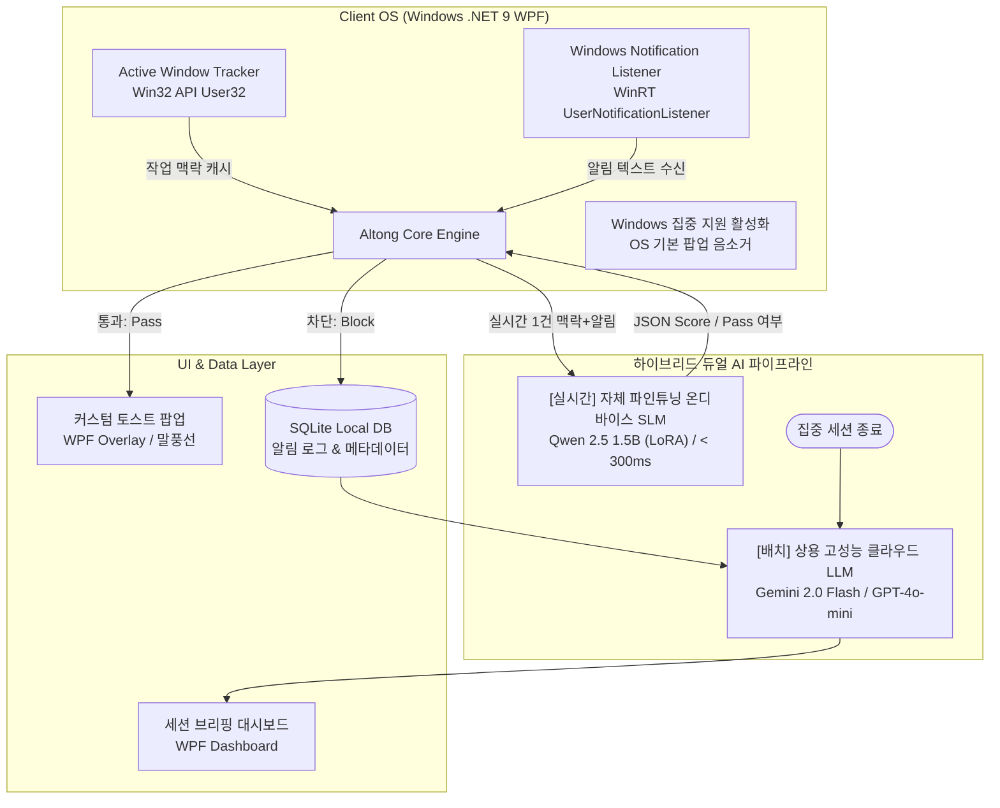
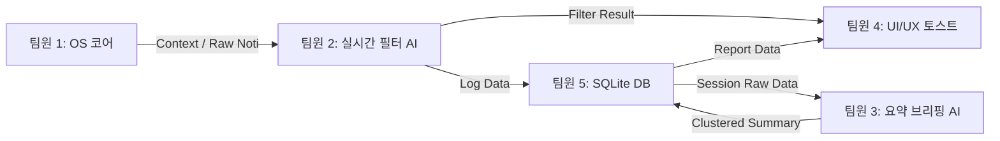

# 🧠 Altong (알통) - ContextPass
> **작업 화면 맥락과 중요도를 실시간 분석하는 지능형 PC 알림 필터링 및 요약 서비스**  
> *AI 서비스 프로젝트 (3학년 2학기 팀 프로젝트)*

---

## 📌 1. 프로젝트 개요 및 문제 정의

### 1.1 배경 및 문제 제기
- **기존 OS '집중 지원(Focus Assist)'의 한계:**
  - 단순 On/Off 토글 또는 앱 단위 화이트리스트 방식에 불과합니다.
  - 작업 흐름을 방해하는 **불필요한 잡담 알림**과 지금 즉시 대응해야 하는 **긴급 알림**(서버 장애, 배포 실패, 마감 직전 변경 공지 등)을 구분하지 못합니다.
- **컨텍스트 스위칭(Context Switching) 비용 증가:**
  - 개발, 문서 작성, 학업 등 깊은 몰입(Deep Work) 중 울리는 무분별한 알림은 집중력을 저하시킵니다.
  - 학술 연구(ACM CHI)에 따르면, 알림 등으로 작업 흐름이 한 번 깨진 후 원래 몰입 상태로 복귀하는 데 평균 **23분 15초**가 소요됩니다. ([상세 논문 근거](docs/RESEARCH_PAPER.md) 참조)
  - 반대로 모든 알림을 차단하면 긴급 상황을 놓칠까 두려운 **FOMO(Fear Of Missing Out)** 증상이 발생합니다.

### 1.2 솔루션 비전 및 핵심 설계 철학
> **"지금 내가 하는 일에 방해되지 않는 선에서, 중요한 알림만 똑똑하게 통과시키고 나머지는 깔끔하게 요약해 준다."**

1. **간편한 사용 경험 (Zero-Config 1-Click On/Off):**
   - 사용자가 매번 번거롭게 화이트리스트나 룰을 설정하지 않고, 단순한 **On/Off 토글** 하나로 즉시 몰입 세션을 시작합니다.
2. **2단계 지능형 필터링 기준 (Hierarchy):**
   - **(1) 긴급도 (1순위):** 꼭 필요한 알림이 집중 모드에 의해 차단되는 것을 방지하기 위해, 알림 자체의 긴급도를 최우선으로 판단합니다.
   - **(2) 연관도 (2순위):** 긴급도가 보통(Normal) 수준일 때, 현재 작업 맥락(Active Window)과의 연관도를 검토하여 작업 방해를 최소화하면서 필요한 알림을 선별합니다.
3. **무자극 미니멀 UI/UX (Invisible Service):**
   - 서비스는 백그라운드에 조용히 머무르며, **최고 긴급 알림만 경량 팝업**으로 띄웁니다.
   - 그 외 차단된 알림은 화면 하단 호버링 또는 시스템 트레이 배지 카운터(`🛡️ +1`)로 작업 흐름을 방해하지 않고 부드럽게 축적 상태만 표시합니다.
4. **알림 사후처리 자동화 및 선별 기준 커스터마이징:**
   - 집중 모드 종료 시 쌓인 알림들을 자동 카테고라이징하고, **간단한 스마트 답장** 및 **캘린더 등록**을 원클릭으로 자동화합니다.
   - 대시보드에서 선별된 알림에 대한 사용자 피드백(평가)을 수집하여, 개인별 기준에 맞게 추후 집중 모드 필터링에 반영(Feedback Loop)합니다.

---

## ⚙️ 2. 핵심 동작 메커니즘 & 시스템 아키텍처



### 2.1 상세 워크플로우
1. **집중 세션 시작 (간편한 On/Off):** 복잡한 설정 없이 원클릭으로 집중 모드를 활성화하고 Windows '방해 금지/집중 지원' 켬.
2. **작업 맥락 캡처:** 현재 최상단 활성 창(Active Window)의 프로세스명과 윈도우 타이틀을 저비용 Win32 API로 실시간 캐싱.
3. **알림 후킹 및 무음화:** 백그라운드 리스너(`Windows.UI.Notifications.Management.UserNotificationListener`)가 신규 알림 수신 (OS 기본 토스트는 무음화).
4. **2단계 실시간 교차 판별 (< 300ms):**
   - **1단계 (긴급도 채점):** 최고 긴급 알림(서버 장애, 필수 공지 등)은 즉각 통과(Pass).
   - **2단계 (연관도 분석):** 보통 긴급 알림은 현재 작업 맥락(코딩, 문서 작성 등)과의 관련성을 비교 채점하여 통과/차단 결정.
5. **선별적 노출 & 무자극 적재:**
   - **통과(Pass):** 최고 긴급 건만 경량 커스텀 팝업/말풍선으로 즉시 노출.
   - **차단(Mute):** 로컬 SQLite에 무음 적재 및 시스템 트레이 배지 카운터 증가(`🛡️ +1`), 화면 하단 호버링으로 상태 전달.
6. **세션 종료 & 스마트 브리핑 및 피드백 반영:**
   - 고성능 LLM이 부재중 알림 카테고리 요약, 원클릭 스마트 답장 초안, 캘린더 등록 및 업무 일지(TIL) 마크다운 생성.
   - 대시보드에서 알림 선별 결과를 사용자가 평가하고, 이 피드백을 향후 판별 기준으로 지속 반영.

---

## 🧪 3. 데이터셋 구축 및 경량 SLM 파인튜닝 파이프라인 (AI Modeling)

### 3.1 데이터셋 수집 및 증강 (Dataset Pipeline)
* **3대 핵심 데이터 소스 수집:**
  1. **주요 작업 프로그램 리스트:** 개발 도구(VS Code, 터미널), 사무 툴(Word, Notion), 브라우저 등 대표 작업 맥락(Active Window) 정의
  2. **SNS 대화 코퍼스:** AI Hub 한국어 SNS 대화 데이터셋 및 일상 단톡방 잡담 코퍼스
  3. **업무 및 시스템 알림:** 슬랙/지라/이메일 업무 공지, 민원/상담 긴급도 분류 데이터셋 및 쇼핑몰/앱 푸시 알림
* **합성 데이터셋 구축 (Synthetic Data Augmentation):**
  - 위 3대 소스를 결합하여 `[작업 창 맥락] + [인입 알림] + [긴급도/연관도(1~5)] + [Pass 여부] + [판단 사유]` 구조화 데이터셋 2,500~3,000건 생성 및 검수

### 3.2 경량 SLM LoRA 파인튜닝 (Fine-Tuning)
* **베이스 모델 (Base Model):** `Qwen 2.5 0.5B / 1.5B` 또는 `Llama 3.2 1B`
* **파인튜닝 목적:**
  1. **초저지연(Latency) 보장:** 추론 속도 0.3초 이내 확보 (0.5B~1.5B 극소형 파라미터 최적화)
  2. **100% 구조화 출력(Structured JSON) 강제:** 스키마 에러(환각) 0% 달성
  3. **한국어 메신저/개발자 은어 이해:** 단톡방 축약어, 슬랙 개발 용어(핫픽스, 머지 등)의 맥락 매핑
* **학습 도구:** Google Colab / Unsloth (QLoRA)

### 3.3 정량적 성능 평가 계획 (Benchmark & Ablation Study)
* **평가 지표:** 분류 정확도(Accuracy), Macro F1-Score, 추론 지연시간(Latency, ms), JSON 형식 준수율
* **비교 실험 설계:**
  - `Base SLM (Zero-shot)` vs `Fine-tuned ContextPass-SLM (Ours)` vs `Cloud LLM (GPT-4o-mini / Groq)` 성능 비교 장표 도출

---

## 🛠️ 4. 기술 스택 및 환경

| 레이어 | 기술 스택 | 설명 및 선정 이유 |
| :--- | :--- | :--- |
| **OS 타깃** | **Windows 10 / 11** | WinRT API 및 Win32를 통한 시스템 알림/활성 창 수신 |
| **클라이언트 플랫폼** | **C# 13 / .NET 9 (`net9.0-windows`)** | 최신 .NET 9 기반 고성능 데스크톱 앱 개발 |
| **데스크톱 GUI** | **WPF (Windows Presentation Foundation)** | 트레이 상주, 다이내믹 HUD 및 커스텀 토스트 오버레이 |
| **알림 리스너** | **WinRT (`UserNotificationListener`)** | Windows 공식 알림 수신 API |
| **맥락 캡처** | **Win32 API (`User32.dll`)** | `GetForegroundWindow`, 창 제목 및 프로세스 저비용 추적 |
| **실시간 필터 AI** | **자체 파인튜닝 로컬 SLM (Qwen 2.5 1.5B)** | **0.3초 이내 초저지연**, 온디바이스 개인정보 보호, 100% JSON 스키마 |
| **요약/브리핑 AI** | **상용 클라우드 LLM (Gemini 2.0 Flash / GPT-4o-mini)** | 수십 개 알림 묶음의 고차원 문맥 이해, 마크다운 TIL 자동 생성 |
| **데이터베이스** | **SQLite** (로컬 파일 기반) | 네트워크 의존성 없는 빠른 쓰기, 세션 및 알림 로컬 보관 |
| **보조 도구 / 테스트** | **Altong.MockGenerator, xUnit** | 가상 Windows 토스트 발송 도구 및 테스트 |

---

## 🚀 5. 시작하기 (Quick Start)

### 5.1 사전 요구사항
* Windows 10 (버전 1809 이상) 또는 Windows 11
* [.NET 9 SDK (x64)](https://dotnet.microsoft.com/download/dotnet/9.0) 설치 필요

### 5.2 프로젝트 빌드 및 실행

```powershell
# 1. 저장소 복제
git clone https://github.com/AIoish/ALTONG_client.git
cd ALTONG_client

# 2. 전체 솔루션 의존성 복원 및 빌드
dotnet build Altong.Client.sln

# 3. 메인 클라이언트 앱 실행
dotnet run --project src/Altong.Client

# 4. 개발/테스트용 모의 알림 생성기 실행 (선택)
dotnet run --project tools/Altong.MockGenerator

# 5. 단위 테스트 실행
dotnet test
```

---

## 📁 6. 프로젝트 디렉토리 구조

```text
ALTONG_client/
├── src/
│   └── Altong.Client/              # [메인] C# .NET 9 WPF 데스크톱 클라이언트
│       ├── Models/                 # 공통 데이터 계약 모델 (RawNotification, CurrentContext 등)
│       ├── App.xaml / MainWindow.xaml
│       └── Altong.Client.csproj
├── tools/
│   └── Altong.MockGenerator/       # [도구] 모의 알림 발생 도구 (테스트/실험용 WPF 앱)
│       ├── NotificationPresets.cs  # 테스트 알림 템플릿 프리셋
│       └── README.md               # 도구 사용법 및 연동 가이드
├── tests/
│   └── Altong.Client.Tests/        # [테스트] 단위 및 통합 테스트 프로젝트
├── docs/                           # [문서] 협업 가이드, 학술 레퍼런스, 기능 백로그
│   ├── CONTRIBUTING.md             # Git 브랜치, 커밋, PR 협업 규칙
│   ├── codex-guidelines.md         # AI 코덱스 작업 가이드라인
│   ├── FEATURE_BACKLOG.md          # 확장 기능 아이디어 백로그
│   ├── RELEASE_SPEC.md             # v1.0 릴리즈 명세서
│   └── RESEARCH_PAPER.md           # 관련 학술 연구 논문 근거
├── Altong.Client.sln               # Visual Studio / .NET 솔루션 파일
└── README.md                       # 메인 명세서
```

---

## 🧩 7. 모듈 간 데이터 인터페이스 (Data Contract)

클라이언트와 AI, DB 모듈 간에 합의된 불변 데이터 스키마입니다. C# 모델은 [`src/Altong.Client/Models/`](src/Altong.Client/Models)에 정의되어 있습니다.

### 7.1 알림 이벤트 객체 (`RawNotification`)
* **JSON 스키마:**
  ```json
  {
    "id": "noti_20260913_001",
    "app_name": "Slack",
    "sender": "김철수 팀장",
    "title": "[긴급] 서버 배포 오류",
    "body": "지금 102번 서버 에러로 인해서 긴급 핫픽스 부탁드립니다.",
    "timestamp": "2026-09-13T18:05:00"
  }
  ```
* **C# Record (`RawNotification.cs`):**
  ```csharp
  public record RawNotification(
      string Id,
      string AppName,
      string Sender,
      string Title,
      string Body,
      DateTime Timestamp);
  ```

### 7.2 작업 맥락 객체 (`CurrentContext`)
* **JSON 스키마:**
  ```json
  {
    "active_process": "Code.exe",
    "window_title": "auth_controller.py - AI Alarm - Visual Studio Code",
    "last_updated": "2026-09-13T18:04:55"
  }
  ```
* **C# Record (`CurrentContext.cs`):**
  ```csharp
  public record CurrentContext(
      string ActiveProcess,
      string WindowTitle,
      DateTime LastUpdated);
  ```

### 7.3 실시간 필터 판단 결과 (`FilterResult`)
```json
{
  "notification_id": "noti_20260913_001",
  "is_passed": true,
  "urgency_score": 5,
  "relevance_score": 4,
  "category": "긴급 업무",
  "ai_summary_reason": "현재 백엔드 코드 작성 중 발생한 서버 핫픽스 요청으로 즉시 확인 필요"
}
```

---

## 👥 8. 5인 팀 업무 분장 (R&R) & 모듈 인터페이스



| 담당자 | 포지션 & 역할 | 주요 개발 산출물 및 담당 태스크 |
| :--- | :--- | :--- |
| **팀원 1** | **클라이언트 시스템 엔지니어 (OS 코어)** | • WinRT 기반 Windows 알림 수신 리스너 구축<br/>• Win32 기반 활성 창/프로세스 주기적 추적기<br/>• Windows 집중 지원(방해 금지) 상태 제어/가이드 모듈 |
| **팀원 2** | **AI 엔지니어 (데이터셋 & 실시간 필터링)** | • 알림-맥락 긴급도 데이터셋 수집, 증강 및 전처리<br/>• 경량 SLM(Qwen 2.5 0.5B/1.5B) LoRA 파인튜닝 및 양자화<br/>• 100% JSON 스키마 강제 파이프라인 및 벤치마크 평가 |
| **팀원 3** | **AI 엔지니어 (요약 및 브리핑)** | • 세션 차단 알림 임베딩 및 비지도 클러스터링 모듈<br/>• 클러스터별 3줄 요약 및 To-Do / 일정 추출 프롬프트<br/>• **창 추적 로그 + 알림 결합 마크다운 업무 일지(TIL) 자동 생성 파이프라인** |
| **팀원 4** | **데스크톱 UI/UX 개발자** | • 시스템 트레이 백그라운드 상주 앱 (WPF)<br/>• 다이내믹 포커스 HUD (화면 상단 반투명 캡슐 오버레이 & 방어 애니메이션)<br/>• 세련된 커스텀 토스트 알림 팝업 및 집중 타이머 UI |
| **팀원 5** | **풀스택 / 데이터 & 대시보드 (통합 PL)** | • 로컬 SQLite 스키마 설계 및 데이터 액세스 레이어(DAO)<br/>• 세션 종료 후 요약 리포트 대시보드 (스마트 답장, 캘린더 연동, **TIL 원클릭 복사**)<br/>• 5개 모듈 결합 E2E 테스트 및 최종 시연 시나리오 총괄 |

---

## 🔗 9. 협업 규칙 및 관련 문서

* 📘 **협업 지침 (브랜치, 커밋, PR):** [`docs/CONTRIBUTING.md`](docs/CONTRIBUTING.md)
* 🤖 **AI 코덱스 작업 규칙:** [`docs/codex-guidelines.md`](docs/codex-guidelines.md)
* 💡 **확장 기능 아이디어 백로그:** [`docs/FEATURE_BACKLOG.md`](docs/FEATURE_BACKLOG.md)
* 🚀 **v1.0 정식 릴리즈 명세서:** [`docs/RELEASE_SPEC.md`](docs/RELEASE_SPEC.md)
* 📚 **연구 논문 학술 근거:** [`docs/RESEARCH_PAPER.md`](docs/RESEARCH_PAPER.md)
