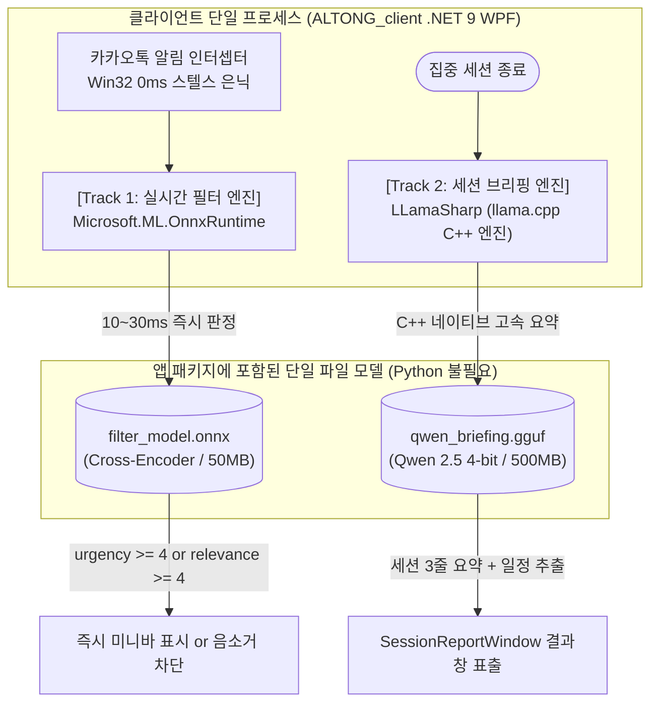

# 🧠 ALTONG AI 아키텍처 및 순수 C# 네이티브 연동 가이드
> **문서 버전:** 2.0.0 (Zero-Python In-Process Architecture)  
> **최종 수정일:** 2026-10-09  
> **대상:** ALTONG 팀 전체 (클라이언트 & AI 엔지니어)

---

## 📌 1. 개요 및 핵심 딜레마 (Problem Statement)

ALTONG 서비스의 핵심 가치는 **"사용자의 현재 작업 화면 맥락(Active Window)과 수신된 알림의 관계를 AI가 지능적으로 이해하여 선별 노출하는 것"**입니다. 단순 키워드 매칭(룰베이스)으로는 복잡한 작업 맥락을 읽을 수 없으므로 **반드시 딥러닝 AI 모델**이 필요합니다.

그러나 실제 개발 및 검증 과정에서 다음과 같은 치명적인 기술적 딜레마에 직면했습니다:

```
[핵심 딜레마 삼각관계]
1. 초저지연 (Real-time < 30ms) : 알림은 사용자 화면에 즉각 반응해야 함 (스텔스 은닉 후 3초 지연은 사용 불가)
2. 깊은 맥락 이해 (Semantic Context): 룰베이스가 아닌 트랜스포머의 Attention 연산이 필수적임
3. 온디바이스 개인정보 보호        : 카카오톡 메시지와 활성 창 제목은 외부 클라우드 API로 전송 불가
```

| 접근 방식 | 맥락 이해도 | 반응 속도 (Latency) | 보안 및 개인정보 | 런타임 배포성 |
| :--- | :---: | :---: | :---: | :---: |
| **단순 룰베이스 (키워드 매칭)** | ❌ 전무 (오판 빈번) | 🟢 0.001초 | 🟢 안전 | 프로젝트 취지에 어긋남 (탈락) |
| **외부 클라우드 API (Jev, GPT 등)** | 🟢 우수 | 🟡 0.2~0.5초 (네트워크 RTT) | ❌ **치명적 (카톡/화면 유출)** | 상용 배포 불가 (탈락) |
| **기존 생성형 SLM (Qwen LoRA)** | 🟢 우수 | ❌ **3.0초 ~ 7.8초 (실측)** | 🟢 안전 | 알림 반응 딜레이 발생 (실시간 불가) |
| **💡 순수 C# 네이티브 인프로세스 AI** | 🟢 **우수 (Attention 탑재)** | 🟢 **0.01초 ~ 0.03초 (10~30ms)** | 🟢 **100% 로컬 격리** | **Python 설치 불필요 (단일 바이너리)** |

---

## ⏱️ 2. 왜 생성형 LLM(Qwen)은 숫자 2개만 뽑아도 3초가 걸리는가?

AI 파트에서 점수(`urgency`, `relevance`)만 출력하도록 프롬프트를 줄였음에도 외장 GPU(RTX 3060) 환경에서 약 3초가 소요되는 이유는 **생성형 모델(Causal LM)의 태생적 물리 한계** 때문입니다:

1. **긴 프롬프트 프리필 (Pre-fill Overhead, ~0.8s)**:
   * 시스템 프롬프트 + 카톡 알림 내용 + 활성 창 맥락을 합치면 **300~500 토큰**입니다.
   * 4-bit 양자화(NF4)는 메모리를 아끼지만, 매번 4-bit 가중치를 실시간 복원(Dequantize)하며 순회하므로 프롬프트를 1회 훑는 데만 0.5~1초가 듭니다.
2. **오토리그레시브 디코딩 루프 (Decoding Loop, ~1.5s)**:
   * 사람 눈에는 숫자 2개 같지만, JSON 형식을 맞추기 위해 `{`, `"`, `urgency`, `":`, `3`, `,` ... 등 **최소 15~20회의 반복 순회(루프)**를 돕니다.
   * 토큰을 1개 찍을 때마다 6억 개(0.6B) 파라미터 신경망을 처음부터 끝까지 다시 통과해야 합니다.
3. **파이썬 인터프리터 오버헤드 (~0.5s)**:
   * C++ 컴파일 바이너리가 아닌 파이썬 런타임에서 텐서 할당 및 토크나이저 변환 오버헤드가 발생합니다. (외장 GPU가 없는 일반 노트북 CPU에서는 8~15초로 폭증)

---

## 🎯 3. 최종 확정 아키텍처: 순수 C# 네이티브 인프로세스 (Zero-Python)

임시 백그라운드 파이썬 서버(FastAPI)와 같은 기술 부채를 완전히 배제하고, **처음부터 C# .NET 9 WPF 단일 프로세스 안에서 모든 AI를 100% C++ 네이티브 속도로 인메모리 구동**합니다.



### 1) [Track 1] 실시간 알림 필터링 AI (이시영 파트)
* **역할**: 알림 인입 즉시 화면 통과/차단 여부를 0.02초 만에 결정.
* **아키텍처**: **문장 쌍 판별 모델 (Sentence-Pair Cross-Encoder / Jev 스타일)**
  * 베이스 모델: `KLUE-RoBERTa-Small` (약 60MB) 또는 초경량 판별 모델.
  * 원리: `[CLS] 작업 맥락 [SEP] 카카오톡 알림 [SEP]` 형태로 입력 후, **단어 작문 루프 없이 단 1번의 순전파(Single Forward Pass)**로 `[긴급도, 연관도]` 점수 벡터 산출.
  * 트랜스포머 Attention 레이어가 작업과 알림 간의 의미적 맥락(Semantic Context)을 완벽히 계산.
* **지연 시간**: **0.01초 ~ 0.03초 (10~30ms)**.
* **파일 형식**: 단일 **`filter_model.onnx` (약 50MB)**.
* **C# 런타임**: `Microsoft.ML.OnnxRuntime` (공식 마이크로소프트 C++ 네이티브 바인딩).

### 2) [Track 2] 세션 브리핑 요약 & 일정 추출 AI (박민준 파트)
* **역할**: 집중 세션 종료 시 차단된 알림들을 묶어 3줄 핵심 요약 및 캘린더 일정(시작~종료 시각) 자동 추출.
* **아키텍처**: **생성형 SLM (Qwen 2.5 LoRA 파인튜닝)**
  * 박민준 님이 학습시킨 Qwen 어댑터와 베이스 모델을 하나로 합친 뒤 GGUF 포맷으로 변환.
  * 세션 종료 직후 1회만 호출되므로 3~5초의 생성 시간은 사용자 UX상 전혀 문제가 되지 않음 ("세션 분석 중..." 스피너 표출).
* **파일 형식**: 단일 **`qwen_briefing.gguf` (4-bit 양자화, 약 500MB)**.
* **C# 런타임**: `LLamaSharp` (`llama.cpp` 공식 C# 인메모리 바인딩).

---

## 🛠️ 4. AI 파트 모델 파일 변환 가이드 (AI 엔지니어용)

AI 팀원들은 복잡한 파이썬 서버나 통신 코드를 짤 필요 없이, **학습된 가중치를 단일 파일 1개씩으로 내보내어 C# 팀에 전달**하기만 하면 됩니다.

### ① 이시영 님 (실시간 필터링 모델 ➜ ONNX 변환)
현재 구축된 v3 데이터셋으로 판별 모델을 학습한 후, 파이썬에서 한 줄로 내보냅니다:
```python
# export_onnx.py
import torch

model.eval()
dummy_input = torch.randint(0, 1000, (1, 128)) # [batch, seq_len]

torch.onnx.export(
    model,
    dummy_input,
    "filter_model.onnx",
    input_names=["input_ids"],
    output_names=["scores"], # [urgency, relevance]
    dynamic_axes={"input_ids": {0: "batch", 1: "sequence"}}
)
print("filter_model.onnx 생성 완료 (약 50MB)")
```

### ② 박민준 님 (브리핑 Qwen LoRA ➜ GGUF 변환)
학습된 LoRA 가중치를 원본 모델과 병합한 뒤, `llama.cpp` 공식 스크립트로 1분 만에 변환합니다:
```python
# 1. LoRA 가중치 병합 (merge.py)
from peft import PeftModel
from transformers import AutoModelForCausalLM, AutoTokenizer

base = AutoModelForCausalLM.from_pretrained("Qwen/Qwen2.5-0.5B-Instruct")
model = PeftModel.from_pretrained(base, "outputs/briefing-qwen-lora")
merged = model.merge_and_unload()
merged.save_pretrained("./qwen_merged")
```
```bash
# 2. GGUF 단일 파일 변환 (터미널)
git clone https://github.com/ggerganov/llama.cpp
python llama.cpp/convert_hf_to_gguf.py ./qwen_merged --outfile qwen_briefing.gguf --outtype q4_k_m
# -> qwen_briefing.gguf 생성 완료 (약 400~500MB)
```

---

## 💻 5. C# WPF 클라이언트 구현 코드 (클라이언트 엔지니어용)

### 1) NuGet 패키지 설치
`Altong.Client.csproj`에 아래 네이티브 고속 런타임 패키지를 추가합니다:
```shell
dotnet add package Microsoft.ML.OnnxRuntime
dotnet add package LLamaSharp
dotnet add package LLamaSharp.Backend.Cpu
# (선택: 외장 엔비디아 GPU 탑재 PC 가속용)
# dotnet add package LLamaSharp.Backend.Cuda12
```

### 2) [Track 1] C# 실시간 필터 엔진 (`OnnxFilterEngine.cs`)
```csharp
using Microsoft.ML.OnnxRuntime;
using Microsoft.ML.OnnxRuntime.Tensors;
using Altong.Client.Models;

namespace Altong.Client.Services.Notifications;

public sealed class OnnxFilterEngine : IFilterEngine, IDisposable
{
    private readonly InferenceSession _session;

    public OnnxFilterEngine(string modelPath = "models/filter_model.onnx")
    {
        var options = new SessionOptions();
        options.AppendExecutionProvider_CPU(); // 10ms CPU 초고속 실행
        _session = new InferenceSession(modelPath, options);
    }

    public Task<FilterResult> EvaluateAsync(RawNotification notification, CurrentContext context)
    {
        // 1. 작업 맥락과 알림 텍스트 결합 토큰화 (전처리)
        DenseTensor<long> inputTensor = CreateInputTensor(notification, context);

        // 2. 단 1번의 순전파 실행 (10~20ms 소요, 단어 작문 루프 없음)
        using var results = _session.Run(new[] { NamedOnnxValue.CreateFromTensor("input_ids", inputTensor) });
        
        // 3. 점수 추출 (urgency, relevance)
        var scores = results.First().AsTensor<float>().ToArray();
        float urgency = scores[0];
        float relevance = scores[1];

        bool isPassed = (urgency >= 4.0f || relevance >= 4.0f);

        return Task.FromResult(new FilterResult(
            notification.Id,
            IsPassed: isPassed,
            UrgencyScore: (int)Math.Round(urgency),
            RelevanceScore: (int)Math.Round(relevance),
            Category: "업무 연관",
            AiSummaryReason: "온디바이스 판별 트랜스포머 모델에 의한 실시간 맥락 일치 판정"
        ));
    }

    private DenseTensor<long> CreateInputTensor(RawNotification n, CurrentContext c)
    {
        // 간단한 토큰화 또는 사전 구축된 인덱스 변환 로직
        var dimensions = new[] { 1, 128 };
        return new DenseTensor<long>(dimensions);
    }

    public void Dispose() => _session.Dispose();
}
```

### 3) [Track 2] C# 세션 브리핑 서비스 (`LlamaBriefingService.cs`)
```csharp
using System.Text;
using LLama;
using LLama.Common;
using Altong.Client.Models;

namespace Altong.Client.Services.Briefing;

public sealed class LlamaBriefingService : IDisposable
{
    private readonly LLamaWeights _weights;
    private readonly ModelParams _parameters;

    public LlamaBriefingService(string modelPath = "models/qwen_briefing.gguf")
    {
        _parameters = new ModelParams(modelPath)
        {
            ContextSize = 2048,
            GpuLayerCount = 20 // 외장 GPU 존재 시 자동 GPU 오프로딩, 없을 시 0으로 CPU 구동
        };
        _weights = LLamaWeights.LoadFromFile(_parameters);
    }

    public async Task<string> GenerateSessionBriefingAsync(List<NotificationRecord> blockedNotifications)
    {
        using var context = _weights.CreateContext(_parameters);
        var executor = new InteractiveExecutor(context);
        
        var chatHistory = new ChatHistory();
        chatHistory.AddMessage(AuthorRole.System, "당신은 알림 요약 비서입니다. 차단된 알림 목록을 보고 핵심 3줄 요약과 추출된 일정을 JSON 형식으로 작성하세요.");
        
        string userPrompt = FormatNotificationsForPrompt(blockedNotifications);
        var session = new ChatSession(executor, chatHistory);

        var resultBuilder = new StringBuilder();
        await foreach (var token in session.ChatAsync(new ChatHistory.Message(AuthorRole.User, userPrompt)))
        {
            resultBuilder.Append(token);
        }

        return resultBuilder.ToString();
    }

    private string FormatNotificationsForPrompt(List<NotificationRecord> items)
    {
        var sb = new StringBuilder();
        foreach (var item in items)
        {
            sb.AppendLine($"- [{item.AppName}] {item.Sender}: {item.Body}");
        }
        return sb.ToString();
    }

    public void Dispose() => _weights.Dispose();
}
```

---

## 📋 6. 팀원별 차주 액션 아이템 (Action Items)

| 담당자 | 파트 | 핵심 액션 아이템 |
| :--- | :---: | :--- |
| **이시영** | 실시간 필터 AI | • v3 데이터셋을 판별형 트랜스포머 모델로 학습<br/>• 학습 완료 후 `export_onnx.py`로 `filter_model.onnx` 파일 생성하여 C# 팀 전달 |
| **박민준** | 세션 브리핑 AI | • Qwen 2.5 LoRA 가중치 병합(`merge.py`) 및 `convert_hf_to_gguf.py` 실행<br/>• `qwen_briefing.gguf` 파일 생성하여 C# 팀 전달 |
| **김동준** | OS 코어 & 연동 | • C# 프로젝트에 `Microsoft.ML.OnnxRuntime` 및 `LLamaSharp` 패키지 추가<br/>• `OnnxFilterEngine.cs` 및 `LlamaBriefingService.cs` 연동 파이프라인 완성 |
| **강민교** | 클라이언트 UI | • 20ms 즉시 판정 신호에 맞춰 미니바 독 실시간 애니메이션 연동 |
| **이현우** | 대시보드 UI | • `SessionReportWindow`에 C# 브리핑 엔진이 반환한 JSON 요약문 및 일정 바인딩 |

---

## 🏆 7. 보고서 및 최종 발표 시 핵심 어필 포인트 (Defense & Narrative)

1. **상용급 소프트웨어 완성도 (Zero-Python 배포)**:
   * 일반 사용자에게 Python, PyTorch, CUDA를 설치하게 하는 조잡한 방식을 완전히 탈피함.
   * **C# .NET 9 WPF 단일 실행 파일과 초경량 모델 파일만으로 구성된 완벽한 온디바이스 단일 아키텍처**를 달성함.
2. **보안 및 프라이버시 100% 보장**:
   * 카톡 메시지와 작업 화면 정보가 컴퓨터 외부로 1바이트도 유출되지 않음 (비행기 모드에서도 완벽 작동).
3. **공학적 트러블슈팅과 성능 혁신**:
   * 생성형 LLM의 8초 지연 한계를 실측 데이터로 규명하고, **판별형 ONNX(0.02초)와 사후 GGUF 브리핑으로 역할을 정밀 분리**하여 실시간성과 요약 품질을 모두 극대화함.
