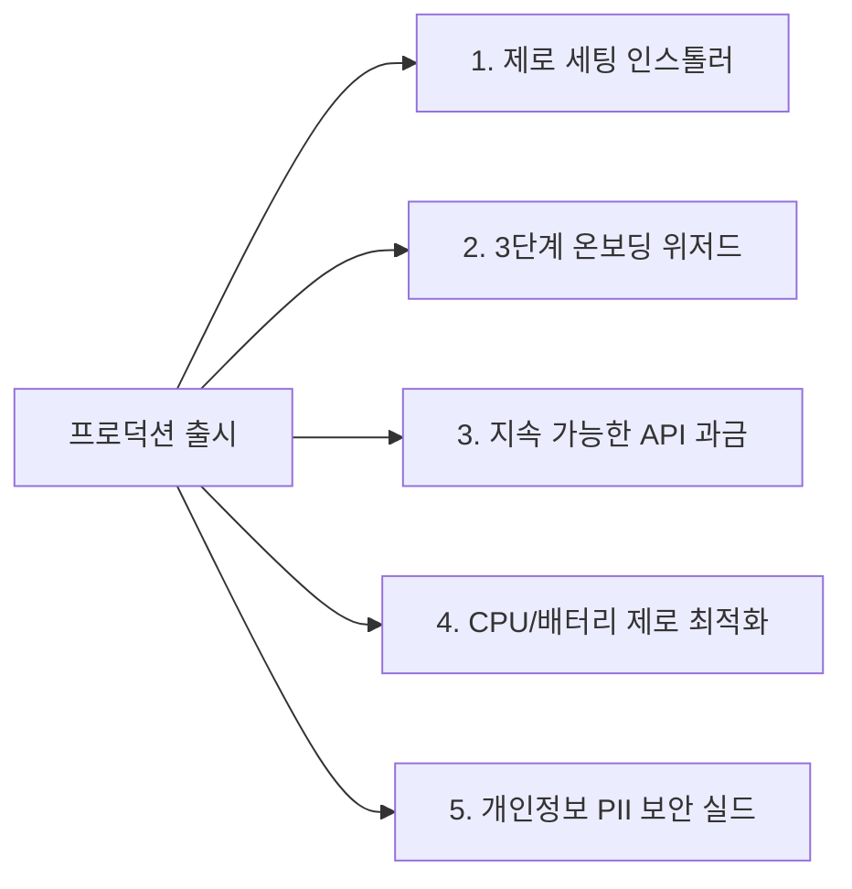

# 🚀 ContextPass 정식 프로덕트 출시 명세서 (Production Release Spec)
> **학부 과제(MVP)를 넘어 일반 사용자 대상의 실제 소프트웨어 제품(v1.0)으로 출시하기 위한 프로덕션 엔지니어링 명세서**

---

## 🎯 1. 출시 목표 및 배포 채널

* **배포 형태:** Windows 10 / 11 전용 단일 설치 프로그램 (`ContextPass_Setup_v1.0.exe`)
* **타깃 사용자:** 컨텍스트 스위칭으로 고통받는 개발자, 연구원, 대학생, 원격 근무 직장인
* **출시 채널:**
  - 🌐 GitHub Releases (오픈소스 바이너리 배포)
  - 📢 긱뉴스(GeekNews), 디스콰이엇(Disquiet) 제품 론칭
  - 🏆 대학 캡스톤/공모전 출품 및 Product Hunt 론칭

---

## 🛠️ 2. 프로덕션 출시를 위한 5대 필수 엔지니어링 과제



---

### 2.1 [설치/배포] 제로 세팅 원클릭 인스톨러 (Zero-Setup Packaging)
* **목표:** Python이나 의존성 라이브러리가 없는 일반 PC에서도 더블 클릭 한 번으로 설치 완료.
* **구현 방식:**
  - **PyInstaller / Nuitka 빌드:** Python 런타임, PyQt6 라이브러리, SQLite 엔진을 단일 바이너리로 컴파일.
  - **Inno Setup 스크립트 구축:**
    - 표준 Windows 설치 마법사 UI (설치 경로 선택, 라이선스 동의)
    - 바탕화면 바로가기 및 시작 메뉴 등록
    - **"Windows 시작 시 자동 실행 (시작 프로그램 등록)"** 레지스트리 옵션 제공 (`HKCU\Software\Microsoft\Windows\CurrentVersion\Run`)

---

### 2.2 [온보딩 UX] 최초 실행 3단계 권한 가이드 (Permission Wizard)
* **목표:** Windows의 '알림 접근 권한' 미허용으로 인한 사용자 이탈(Chun)을 방지.
* **구현 방식:**
  - 앱 첫 실행 시 모던한 3단계 온보딩 다이얼로그 노출:
    1. **Step 1 (알림 권한 허용):**  
       `[설정창 열기]` 버튼 클릭 시 파이썬이 Windows 알림 권한 설정창을 다이렉트로 호출:
       ```python
       import os
       os.system("start ms-settings:privacy-notifications")
       ```
    2. **Step 2 (집중 지원 모드 연동):**  
       세션 시작 시 방해 금지 모드가 자동으로 켜지도록 시스템 가이드 안내.
    3. **Step 3 (시뮬레이션 테스트):**  
       가상의 모의 알림 1개를 수신하여 커스텀 토스트 및 방어 HUD가 정상 작동하는지 사용자 확인 후 시작.

---

### 2.3 [비용/비즈니스] 지속 가능한 LLM 과금 모델 (BYOK & Hybrid)
* **목표:** 대규모 사용자 유입 시 개발자에게 발생하는 API 토큰 비용 파산 방지.
* **구현 방식 (설정창에서 모드 선택 지원):**
  1. **완전 무료/오프라인 모드 (Free Tier):**
     - 최초 설치 시 경량 모델(Qwen 2.5 1.5B GGUF, 약 1.1GB)을 백그라운드 다운로드.
     - 외부 네트워크 통신 0회, 내 PC 연산만으로 평생 무료 사용.
  2. **초고품질 클라우드 모드 (BYOK - Bring Your Own Key):**
     - Raycast, Cursor의 정책을 벤치마킹하여, 사용자가 본인의 **Google AI Studio(Gemini) 또는 OpenAI API Key**를 직접 입력하게 지원.
     - 사용자는 무료 티어(Gemini 분당 15회 무료)를 통해 비용 없이 최고급 LLM 성능 향유.

---

### 2.4 [성능/배터리] 이벤트 기반 OS 훅 전환 (Event-Driven Optimization)
* **목표:** 노트북 배터리 광탈 방지 및 백그라운드 상주 시 CPU 점유율 0.0% 달성.
* **구현 방식:**
  - ❌ **기존 프로토타입:** 1초마다 무한 반복문(`while True`)으로 활성 창 폴링 (CPU 지속 소모).
  - ⭕ **프로덕션 릴리즈:** Windows OS의 포그라운드 변경 이벤트(`SetWinEventHook` - `EVENT_SYSTEM_FOREGROUND`)를 C-types로 수신.
  - 사용자가 창을 전환하는 순간에만 OS가 시그널을 주므로, **한 창에서 작업 중일 때는 CPU 점유율이 0.0%로 완전 정지**.

---

### 2.5 [보안/프라이버시] 민감 정보(OTP/금융) 자동 마스킹 (PII Sanitizer)
* **목표:** 금융 거래 내역, 2단계 인증(OTP) 번호, 개인정보가 LLM이나 로컬 DB에 평문으로 유출되는 사고 원천 차단.
* **구현 방식:**
  - AI 분석 파이프라인 진입 직전, **정규식(Regex) 기반 PII 마스킹 모듈** 통과:
    - **금융 계좌/카드:** `\d{3,6}[-\s]?\d{2,6}[-\s]?\d{3,6}` ➡️ `[계좌번호 마스킹]`
    - **인증번호/OTP:** `(?:인증번호|코드|OTP)[\s:]*([0-9]{4,6})` ➡️ `[인증번호 ******]`
    - **주민등록번호:** `\d{6}-[1-4]\d{6}` ➡️ `[주민번호 마스킹]`
  - 데이터베이스(SQLite) 저장 시 민감 본문 필드는 선택적 해시/암호화 적용.

---

## 📅 3. 단계별 출시 로드맵 (Release Roadmap)

```text
[Phase 1: 학부 MVP 개발] (현재 단계)
 ├── WinRT 알림 리스너 + 창 추적
 ├── 로컬 SLM 파인튜닝 & Pydantic 구조화
 ├── PyQt6 다이내믹 HUD & 대시보드
 └── 모의 시뮬레이터 기반 시연 준비 완료 (중간/기말 평가 A+ 확보)

[Phase 2: 프로덕션 안정화]
 ├── SetWinEventHook 이벤트 드리븐 전환 (CPU 0.0% 최적화)
 ├── 정규식 기반 PII 마스킹 모듈 삽입
 └── Settings 메뉴 내 BYOK (Gemini/OpenAI Key) 입력창 구현

[Phase 3: 패키징 & 정식 론칭]
 ├── PyInstaller + Inno Setup 단일 설치 파일(.exe) 빌드
 ├── 3단계 온보딩 위저드 탑재
 └── GitHub Release v1.0.0 배포 및 GeekNews 공개
```
