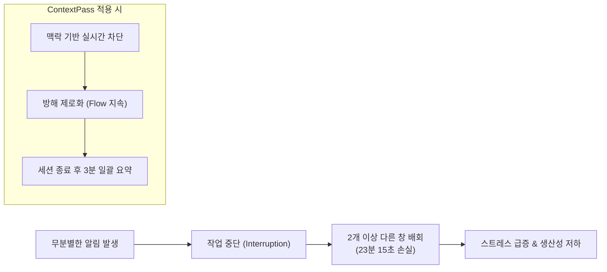

# 📚 학술 연구 근거: 작업 중단 및 컨텍스트 스위칭 비용
> **프로젝트 발표(Pitch Deck), 기획서, 보고서 인용을 위한 공식 논문 레퍼런스 정리**

---

## 🎯 1. 발표 슬라이드용 핵심 한 줄 요약

> ### **"지식 노동자가 단 한 번의 알림이나 방해를 받은 후, 원래 하던 작업으로 온전히 복귀하는 데 걸리는 시간은 평균 `23분 15초`입니다."**  
> — *ACM CHI 2005 (인간-컴퓨터 상호작용 최고 권위 학회), Gloria Mark 교수 연구팀*

---

## 📄 2. 핵심 논문 상세 정보

### 🥇 메인 논문 (23분 15초 통계 출처)
* **논문명:** *No Task Left Behind? Examining the Nature of Fragmented Work*
* **저자:** Gloria Mark (UC Irvine), Victor M. Gonzalez, Justin Harris
* **학회/저널:** **ACM CHI 2005** (Conference on Human Factors in Computing Systems)
* **권위/신뢰도:** 컴퓨터공학/HCI(인간-컴퓨터 상호작용) 분야 세계 최고 권위(Top-tier) 학회
* **공식 링크:**
  - 🔗 [ACM Digital Library 공식 DOI (10.1145/1054972.1055034)](https://doi.org/10.1145/1054972.1055034)
  - 📄 [UC Irvine 연구실 공식 PDF 다운로드](https://www.ics.uci.edu/~gmark/chi05-mark.pdf)

#### 🔍 주요 연구 결과
1. **평균 복구 시간 23분 15초:**  
   작업이 중단되면 즉시 원래 작업으로 돌아가지 못하고, 평균 **2개 이상의 다른 부수적 작업(Intervening Tasks)**을 거친 뒤에야 원래 작업으로 복귀함.
2. **작업 파편화(Fragmentation) 심각성:**  
   지식 노동자는 평균 **3분 5초**마다 작업 창을 전환하며, 한 작업 영역(Working Sphere)에 머무는 시간은 평균 **10분 30초**에 불과함.
3. **방해의 기원:**  
   전체 중단의 약 50%는 외부 알림/타인의 개입(External interruptions)이며, 나머지 50%는 흐름이 깨진 후 스스로 유발하는 딴짓(Self-interruption)임.

---

### 🥈 후속 연계 논문 (스트레스 및 정신적 비용)
* **논문명:** *The Cost of Interrupted Work: More Speed and Stress*
* **저자:** Gloria Mark, Daniela Gudith, Ulrich Klocke
* **학회:** **ACM CHI 2008**
* **공식 링크:**
  - 🔗 [ACM Digital Library 공식 DOI (10.1145/1357054.1357072)](https://doi.org/10.1145/1357054.1357072)
  - 📄 [UC Irvine 연구실 공식 PDF 다운로드](https://www.ics.uci.edu/~gmark/chi08-mark.pdf)

#### 🔍 주요 연구 결과
* **보상적 과속(Compensatory Speed):** 중단을 자주 겪은 사용자는 마감을 맞추기 위해 더 빨리 일하려고 시도함.
* **치명적 부작용:** 작업 속도를 억지로 올리면서 **스트레스(Stress), 좌절감(Frustration), 인지적 작업 부하(Perceived Workload), 시간 압박감**이 통계적으로 유의미하게 급증함.

---

## 💡 3. ContextPass 프로젝트와 논리적 연결 (발표 스토리텔링)

심사위원과 청중을 설득할 때 아래 논리 구조를 그대로 활용하세요.

### 📊 정량적 효과(ROI) 환산 공식 (대시보드 기능 탑재 근거)
* **알림 1회 차단 = 약 23분의 컨텍스트 스위칭 비용 방어**
* 하루 2시간 코딩 집중 세션 중 불필요한 단톡방/광고 알림 **10개 차단** 시:
  $$\text{절약된 인지 스위칭 위험 시간} \approx 10 \times 23\text{분} = \mathbf{230\text{분 (약 3.8시간)}}$$
* *"ContextPass는 단순히 소리를 끄는 앱이 아니라, 사용자의 3.8시간에 달하는 인지 에너지와 깊은 몰입(Flow)을 지켜주는 솔루션입니다."*

---

## 🎤 4. 발표 PPT 슬라이드 대본 예시 (Tip)

> **[슬라이드 1: 문제 제기]**  
> *"여러분, 코딩이나 과제를 하다가 울린 카톡 알림 하나를 확인하고 다시 원래 집중 상태로 돌아오는 데 얼마나 걸릴까요? 1~2분일까요?  
> 인간공학 및 HCI 최고 권위 학회인 ACM CHI의 Gloria Mark 교수 연구에 따르면, **작업자가 방해를 받은 후 원래 작업으로 복귀하는 데 걸리는 시간은 평균 '23분 15초'**에 달합니다.  
> 알림을 확인하는 순간 다른 창을 켜고, 딴짓을 하게 되는 연쇄 반응이 일어나기 때문입니다."*

> **[슬라이드 2: 솔루션 제시]**  
> *"그래서 저희는 알림을 '다 끄는' 극단적인 방법 대신, **현재 작업 맥락과 관련 없는 알림만 AI가 똑똑하게 차단**하고, **세션 종료 후 1장의 브리핑으로 수렴**하는 ContextPass를 개발했습니다."*
